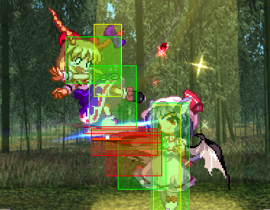
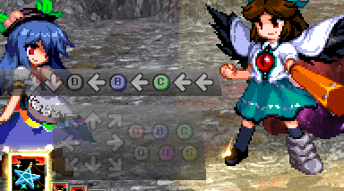

# ReplayInputView++

This mod is a renewed edition of **ReplayInputView** and **ReplayInputView+** through customized development, specifically designed to display inner game info for *Hisoutensoku*, which helps players build a insight for general gameplay or mods developing.

To make it simple, we use **RIV** in the following to represent the term ***ReplayInputView***.

## Ⅰ: Basic Functions

### 1. BoxDisplaying(F4)



Displays game <span style="color:#ff8080">hitboxes</span> and <span style="color:#80ff80">hurtboxes</span> in replay and local duel, as a convenient and clear approach to visualize and find out what's going on.

Also displays <span style="color:#f0f080">collision box</span> and an <u>position anchor</u>, which is firstly implemented by **RIV+**.

### 2. Debug Info(F6)

The original debug info panel is deprecated out of memory leak when using along with giuroll.

View its reworked and superior edition in the following "What's New" part.

### 3. Input Display(F7)



This panel splits into 2 part, the upper record of history inputs, the lower panel for real-time directional key and buttons by frames.

### 4. Decelerate(F9)/ Accelerate(F10)/ Pause(F11)/ Frame Step(F12)

Allow key control on battle process of original game.

The delay-adjusting method has becomes invalid due to giuroll's locking framerate to 60f+, so only discrete integer rate steps can be used now, eg. $\frac{1}{3}\rightarrow\frac{1}{2}\rightarrow1\rightarrow\frac{2}{1}\rightarrow\frac{3}{1}$


### 5. Modified combo counter to show at 1 hit

This is to simply edit assembly value and breaks the hidden-until-2-hits limitation.


## Ⅱ: What's New

### 1. About Boxes

This is where this mod began. The idea of re-developing RIV came from inaccurate and missing box display on objects, which sets me off on this long developing journey. Here are the new features that I believe introduce real improvement.

#### Add missing hurtbox for objects (bullet collision)


Now you can see them.

The color profile is adjustable in config file, with different colors and styles to tag special box states like invulnerable, parry bullet/melee, yukari gap and so on.

By the way, I also adds boxes for ground heights.


#### Remove fill color for inactive boxes

This really marks fake boxes and make box logic more accurate, especially for bullets.


More works are done to filter some other fake box cases.


#### Make use of d3d9 stencil test to avoid box overlapping together


As shown in the picture, which one is clearer?

Also, you have a choice to only keep the outer most outline, which is considered as "box merging", to make them even more distinguishable between objects and players.


### 2. Supported all the local play mode

By **RIV++**, all the functions are now available also in Arcade mode and **Story mode**.

We can now finally view boxes in story! 


### 3. Added Armor Meter

Dragon-star armor mechanism now has been fully analyzed. Turn on boxes to view the circles and find out how it works.


### 4. Input panel optimizations


#### Displays buffer by highlighted stroke

Input buffers are now visible if you are in a cancel chain.

#### Fade out history recorded buttons

The record displayed now has a fade out effect to make later inputs distinguished. 


### 5. Brand new debug panel(F6)


Or we should call it a **window** now. To enable panels to displays more info as possible, we developed it to be a individual window using *D3DAdditionalSwapChain* technique.

We also designed a gui system to manage expanded layouts functions through xml files, to make it more portable and flexible. Which means, it is even able to be customized if you like.

To also enable object debug, mouse interface is introduced. You can select anchors in game screen using mouse and then view its info through the debug window, just like players.


Hint: gui object anchors are rendered as a diamond.


### 6. Break hotkey range limits

The original RIV checks input from FKey array, which limits hotkey choice to function keys. And RIV++ turns to direct x input, so any key on keyboard is now usable.


## Ⅲ: How do I customize it?

#### This mod uses assets as shown below:

<details open> <summary>📁 modules/ReplayInputView++/</summary>
<details open> <summary>📁 fonts</summary>
    🔠 CascadiaCode-Mod.ttf<br>
    🔠 SmileySans-Oblique.ttf<br>
    📄 font-expand-codepage.py
</details>
<details open> <summary><b>📄 ReplayInputView.dat</b></summary>
    <details open> <summary>📁 rivpp/</summary>
		ArmorBar<br>
        ArmorLifebar<br>
    </details>
</details>
    ⚙️ ReplayInputView++.ini
</details>


### ReplayInputView++.ini

Lets's start from taking a look at the content of `.ini` config file.

#### [Keys]

Hotkeys are editable, it's ok to change to other keys you like.

#### [ColorProfile]

You can change colors for different box states.

For more details, view descriptions in .ini instead.


### Replacing files in .dat

Feel free to unpack `ReplayInputView++.dat` file with [**shady-cli**](https://hisouten.koumakan.jp/wiki/Shady_Packer/Shady_Cli), and replace files to customize it.

```bash
::Unpack Commands For example
REM Unpacking ReplayInputView++.dat to folder 
shady-cli -pack -m dir -o <output-folder-path> <input-dat-file-path>
```


## Editing layout+


This xml has expanded features out of original soku layout system, implemented by ReplayInputView++
本布局文件含有非想天则原有布局系统之外的扩展特性（由RIV++负责实现）


#### Introductions: 

介绍如下：
  - `<window width="240" height="600"/>`
    Class window: controls the size of debug window by w/h properties.
    窗口标签：宽高属性控制窗口大小
    出于调试考虑添加了版本字符串属性。

  - <fonts></fonts>
    Class fonts: font collection for later reference.
  - <font/>
    Class font: describes a font with multiple attributes.
    Available attr:
        1. `id`, a integer with which text element can get a fontdesc by `font_id`.
            2. `name`, internal name of win font; should have been installed, or as a file existed in mod's font folder.
               *(the font file must support current system codepage to be successfully loaded)*
            3. `stroke`, use game's black stroke/shadow
            4. `bold`, bold font
            5. `wrap`, would wrap with a given textbox
            6. `height`, font size
            7. `color_top`/`color_bottom`, enables vertical gradient color
            8. `spacing`/`xspacing`, horizontal character spacing
            9. `yspacing`, spacing between lines
#### Customization: 
以下为自定义部分：

  - <suwako inherit="Player"><suwako/>

补充：
    **保留id范围(0~99)及用途**: 
    1. `0`: 原版的默认显示id，不可索引；
        2. `1`: 鼠标点选的提示图片；
        3. `2`: 光标图片.

-->


#### About Fonts

To keep compatibility for users, we put used fonts in folder and loads them dynamically.

If you want to use your own font, make sure that:

1. **Be aware of the real inner name of font file**: font loading uses inner font-family name or full name with styles, use advanced tools to check the real name of a font file.
2. **Make sure the font supports the charset of your game or PC codepage (usually ANSI, related to th123intl setting)**: even if you only uses ASCII part, codepages not supported still fail font loading and fallback the font to default. 
   We provided a **font-forge** script in python to allow you to quickly expands your font file to full codepage even without available glyphs. The default "CascadiaCode-Mod.ttf" is literally a example.


---

## Special Thanks to:

Testers: 三回転Tstar@[bilibili](https://space.bilibili.com/357511007), monte@discord, miko@QQ; 

Technical support: @enebe-nb, @PinkySmile, @Hagb, @S-len; 

Community support: @soku-cn community players


Honorable credit to the original authors of **RIV**(anonymous one) and **RIV+**(@Shinki, @PCvolt and @delthas), for their pioneering work.


Hates: @ichirin. it tooks us a whole day to find out and fix the problem that your *ScoreTracker* and *PracticeEx* has polluted and ruined `pd3dDev->EndScene()` function by hasty hooks.
just kidding lmao, we love your CIF and other magical mods
